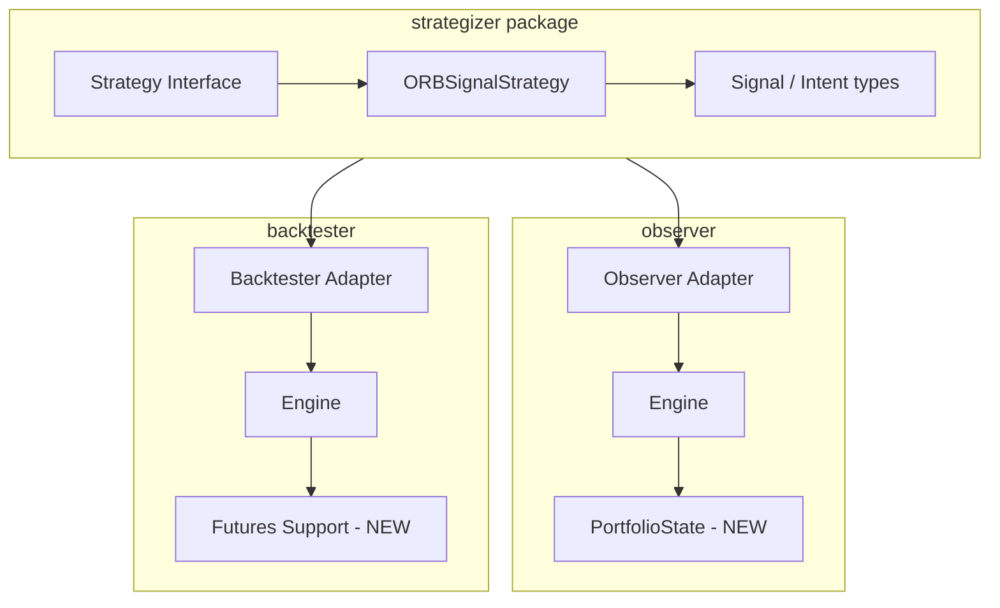

# Cursor Instructions: Strategizer MVP — Shared Strategies for Observer and Backtester

## 0) Objective

Create a shared **strategizer** project so that the same strategies can serve both:

- **Observer** — live futures recommender (adds portfolio awareness; recommends entries and exits)
- **Backtester** — historical simulator (adds futures support; executes the same strategies)

The work scope includes three deliverables executed as one initiative:

1. **Strategizer** — a Python library defining the shared strategy interface and core strategies (e.g., ORB 5m)
2. **Observer portfolio awareness** — add portfolio state so strategies can recommend exits and risk-aware entries
3. **Backtester futures support** — extend backtester to run futures (ES/NQ) with tick sizes, point value, contract specs, and session handling

This document is the **MVP backbone**. All subsequent planning docs (010, 020, …) must conform to it.

---

## 1) MVP Scope

### In scope (must build)

- **Strategizer package** — pure Python library, no FastAPI/CLI; defines shared types and strategy interface
- **Shared domain types** — minimal `BarInput`, `PortfolioView` protocol, `Signal`/`Intent` output type that both consumers can adapt
- **ORB 5m strategy in strategizer** — single reference strategy; runs in both observer and backtester
- **Observer portfolio support** — `PortfolioState` or equivalent; positions from user trades; engine passes to strategies
- **Backtester futures support** — `ContractSpec` for futures (tick_size, point_value, session); DataProvider for futures bars; fill model for tick-aligned futures
- **Adapter layers** — observer and backtester each implement thin adapters: native types ↔ strategizer types
- **End-to-end validation** — ORB produces candidates in observer; same ORB produces orders in backtester on futures data

### Out of scope (do not build in MVP)

- Additional strategies beyond ORB 5m in strategizer
- Options support in observer
- Multi-strategy portfolio optimization
- Strategy auto-discovery in backtester (manual registry remains)

If something is requested outside MVP:
1. add an interface/stub + config flag
2. implement simplest safe default
3. log clearly as not implemented / approximated

---

## 2) Architecture

### High-level flow



### Core principle: Option B (unified strategy)

Strategizer defines a single strategy interface that consumes (market data, portfolio view) and produces a common `Signal` or `Intent` type. Each consumer adapts that to its output format:

- **Observer:** `Signal` → `TradeCandidate` (adds score, explain, valid_until)
- **Backtester:** `Signal` → `Order` (adds qty, order_type, tif)

### Module boundaries

| Module | Responsibility |
|--------|----------------|
| **strategizer** | Shared `Strategy` interface, `Signal`/`Intent` types, `PortfolioView` protocol, `ORBSignalStrategy` |
| **observer** | Adapter: `Context` + `PortfolioState` → strategizer input; strategizer output → `TradeCandidate` |
| **backtester** | Adapter: `MarketSnapshot` + `PortfolioState` → strategizer input; strategizer output → `Order`; futures DataProvider, ContractSpec, fill model |

---

## 3) Shared Types (strategizer defines)

### 3.1 BarInput (minimal bar for strategy consumption)

Strategizer needs a minimal bar type both consumers can produce. Observer `Bar` and backtester `BarRow` are richer; adapters extract:

```python
@dataclass(frozen=True)
class BarInput:
    """Minimal OHLCV bar. Both observer and backtester adapt to this."""
    ts: datetime
    open: float
    high: float
    low: float
    close: float
    volume: float
```

Adapter rule: observer maps `Bar` → `BarInput` (drop symbol, timeframe, source, quality); backtester maps `BarRow` → `BarInput` (add ts from BarRow, volume from BarRow).

### 3.2 PortfolioView (protocol)

Strategizer strategies need to read portfolio state. Both observer and backtester implement this protocol:

```python
class PortfolioView(Protocol):
    """Read-only view of portfolio for strategy decisions."""
    def get_positions(self) -> dict[str, PositionView]: ...
    def get_cash(self) -> float: ...
    def get_equity(self) -> float: ...

@dataclass(frozen=True)
class PositionView:
    instrument_id: str
    qty: int
    avg_price: float
```

Observer: builds `PortfolioView` from user positions (persisted or from broker). Backtester: `PortfolioState` already has this shape; thin adapter implements the protocol.

### 3.3 Signal / Intent (strategy output)

Strategizer strategies emit `Signal`, a neutral trading intent:

```python
@dataclass(frozen=True)
class Signal:
    """Trading intent. Consumer adapts to TradeCandidate or Order."""
    symbol: str
    direction: str  # "LONG" | "SHORT"
    entry_type: str  # "MARKET" | "LIMIT" | "STOP"
    entry_price: float
    stop_price: float
    targets: list[float]
    # Optional metadata; observer uses, backtester may ignore
    score: float = 0.0
    explain: list[str] = field(default_factory=list)
    valid_until: datetime | None = None
```

- **Observer adapter:** `Signal` → `TradeCandidate` (add id, strategy name, tags, created_at; use score, explain, valid_until as-is)
- **Backtester adapter:** `Signal` → `Order` (direction→side, entry_price→limit_price for limit/stop, qty from config or position sizing; tif default GTC)

### 3.4 Strategy interface (strategizer)

```python
class Strategy(ABC):
    @property
    @abstractmethod
    def name(self) -> str: ...

    @abstractmethod
    def requirements(self) -> Requirements: ...

    @abstractmethod
    def evaluate(
        self,
        ts: datetime,
        bars_by_symbol: dict[str, dict[str, list[BarInput]]],
        specs: dict[str, ContractSpecView],
        portfolio: PortfolioView,
    ) -> list[Signal]: ...
```

`ContractSpecView` is a minimal protocol for tick_size, point_value, session (timezone, start_time, end_time). Observer `ContractSpec` and backtester futures `ContractSpec` both implement it.

---

## 4) Observer Changes

### 4.1 Portfolio state

- Add `PortfolioState` (or equivalent) to observer domain
- Source: user positions — either from a persistence layer (SQLite) or a future broker integration; MVP can start with empty/mock
- Engine passes `PortfolioState` to strategies via adapter that implements `PortfolioView`
- Strategy contract: `evaluate(ctx, portfolio)` — extends current `evaluate(ctx)` to include portfolio

### 4.2 Adapter: observer → strategizer

- Maps `Context` → strategizer input: `bars_by_symbol`, `specs`, `ts`
- Maps observer `PortfolioState` → `PortfolioView` (or implements protocol)
- Instantiates strategizer strategy, calls `evaluate(...)`, maps `list[Signal]` → `list[TradeCandidate]`

### 4.3 Engine changes

- Load portfolio state (or mock)
- Pass portfolio to strategy adapter
- Adapter returns TradeCandidates; engine continues as today (store, rank, etc.)

---

## 5) Backtester Changes

### 5.1 Futures domain

- **ContractSpec for futures** — distinct from options `ContractSpec`; fields: symbol, tick_size, point_value, session (TradingSession with timezone). Can live in `domain/` or `domain/futures.py`.
- **instrument_type** — extend Position and fill logic to support `"future"`; multiplier from ContractSpec (e.g., 50 for ES, 20 for NQ).
- **MarketSnapshot for futures** — today: `underlying_bar`, `option_quotes`. For futures run: `underlying_bar` is the futures bar; `option_quotes` is None. Engine and Broker must handle both modes.

### 5.2 DataProvider for futures

- Add `get_futures_bars(symbol, timeframe, start, end) -> Bars`
- Add `get_futures_contract_spec(symbol) -> ContractSpec`
- `LocalFileDataProvider` (or equivalent) must support futures data layout: parquet/CSV with futures bars, metadata for ES/NQ with tick_size, point_value, session.
- Config: `instrument_type: "future"` or `symbol: "ESH26"` implies futures path.

### 5.3 Fill model for futures

- Tick-aligned fills: limit/stop prices must round to tick_size
- Use `observer.core.tick.normalize_price` logic or equivalent in backtester
- No options chain — fills use futures bar close or synthetic bid/ask if quote data exists

### 5.4 Adapter: backtester → strategizer

- Build strategizer input from `MarketSnapshot` + `PortfolioState`
- For futures: `underlying_bar` → `BarInput`; single-symbol bars_by_symbol
- `PortfolioState` implements `PortfolioView`
- Map `list[Signal]` → `list[Order]`; qty from strategy config (configurable, default 1)

### 5.5 Strategy registry

- Add `ORBFuturesStrategy` (or similar) that wraps strategizer ORB
- Registry: `"orb_5m": ORBFuturesStrategy`
- Config supports `instrument_type: future`, `symbol: ESH26`, `timeframe_base: 5m`

---

## 6) Strategizer Package Layout

```
strategizer/
├── pyproject.toml
├── src/
│   └── strategizer/
│       ├── __init__.py
│       ├── types.py       # BarInput, PositionView, Signal, ContractSpecView protocol
│       ├── protocol.py    # PortfolioView, Requirements
│       ├── base.py        # Strategy ABC
│       └── strategies/
│           ├── __init__.py
│           └── orb_5m.py  # ORBSignalStrategy
└── tests/
```

- No dependency on observer or backtester (strategizer is the leaf)
- observer and backtester add `strategizer` as dependency (path or publish)

---

## 7) Implementation Order

### Phase 1: Foundation (strategizer + types)

| Step | Name | Description |
|------|------|--------------|
| **010** | Strategizer skeleton | Create package, pyproject.toml, type stubs |
| **020** | Shared types | BarInput, PositionView, Signal, ContractSpecView, PortfolioView, Requirements |
| **030** | ORB in strategizer | Extract ORB logic from observer; implement Strategy interface; unit tests |

### Phase 2: Observer portfolio + adapter

| Step | Name | Description |
|------|------|--------------|
| **040** | Observer portfolio state | PortfolioState type, persistence/mock, engine wiring |
| **050** | Observer strategizer adapter | Context+Portfolio → strategizer input; Signal → TradeCandidate |
| **060** | Observer ORB from strategizer | Replace local ORB with adapter-wrapped strategizer ORB; regression tests |

### Phase 3: Backtester futures + adapter

| Step | Name | Description |
|------|------|--------------|
| **070** | Backtester futures domain | ContractSpec for futures, instrument_type future, Position/fill support |
| **080** | Backtester DataProvider futures | get_futures_bars, get_futures_contract_spec, LocalFileDataProvider extension |
| **090** | Backtester fill model futures | Tick-aligned prices, futures multiplier |
| **100** | Backtester strategizer adapter | MarketSnapshot+Portfolio → strategizer input; Signal → Order |
| **110** | Backtester ORB strategy | ORBFuturesStrategy wrapping strategizer; registry; config |
| **120** | Golden test | Deterministic backtest: ORB on ES 5m canned data; assert trades |

### Phase 4: Integration

| Step | Name | Description |
|------|------|--------------|
| **130** | End-to-end validation | Run ORB in observer (live/mock); run same ORB in backtester on same scenario; compare outputs |

---

## 8) Dependency Graph

```
010 (Strategizer skeleton)
  -> 020 (Shared types)
    -> 030 (ORB in strategizer)
      -> 040 (Observer portfolio)
        -> 050 (Observer adapter)
          -> 060 (Observer ORB from strategizer)
      -> 070 (Backtester futures domain)
        -> 080 (DataProvider futures)
        -> 090 (Fill model futures)
        -> 100 (Backtester adapter)
          -> 110 (Backtester ORB strategy)
            -> 120 (Golden test)
              -> 130 (E2E validation)
```

- 040 and 070 can proceed in parallel after 030
- 050 and 100 depend on 030; 080 and 090 depend on 070

---

## 9) MVP Acceptance Criteria

MVP is complete when:

1. **Strategizer** — Package installable; ORB strategy produces `list[Signal]` from bars + portfolio; unit tests pass.
2. **Observer** — Engine passes portfolio to strategies; ORB runs from strategizer; TradeCandidates match (or improve on) current ORB behavior; no regression in existing tests.
3. **Backtester** — Runs futures (ES/NQ) with ContractSpec; DataProvider loads futures bars; fill model produces tick-aligned fills; ORB strategy from strategizer produces orders; golden test passes.
4. **Integration** — Same ORB logic executes in both tools; outputs are consistent (same entry/stop/target logic).

---

## 10) Configuration

### Observer config (additions)

```yaml
# config.yaml additions
portfolio:
  enabled: true
  source: mock  # mock | sqlite | broker (future)

strategies:
  orb_5m:
    source: strategizer  # local | strategizer
    # ...existing params
```

### Backtester config (additions)

```yaml
# backtest config
instrument_type: future  # equity | option | future
symbol: ESH26
timeframe_base: 5m

strategy:
  name: orb_5m
  source: strategizer
  params:
    min_range_ticks: 4
    max_range_ticks: 40
    qty: 1  # configurable, default 1
```

---

## 11) Architecture Rules (hard constraints)

| ID | Rule |
|----|------|
| S1 | Strategizer has no dependency on observer or backtester |
| S2 | Strategies are pure: read (bars, specs, portfolio), emit Signal[]; no side effects |
| S3 | Adapters live in consumer projects; strategizer knows nothing about TradeCandidate or Order |
| S4 | PortfolioView and ContractSpecView are protocols; consumers implement them |
| S5 | BarInput is the only bar type strategizer accepts; consumers adapt their native bars |
| S6 | Same strategy code runs in both tools; differences are adapter and output formatting |

---

## 12) Coding Standards

- Python 3.10+
- Type hints everywhere; dataclasses for value types
- Docstrings with "Reasoning:" for non-obvious design choices
- No hidden globals; pass dependencies explicitly
- Tests: unit tests for strategizer types and ORB; integration tests for adapters; golden test for backtester
- See `.cursor/rules/` (if present) for project-specific standards

---

## 13) Decisions

| Decision | Choice | Notes |
|----------|--------|-------|
| Strategizer distribution | Package (path dependency for MVP) | May become a service later; keep strategizer self-contained |
| Observer portfolio source | Mock | Replace with real portfolio when observer becomes portfolio-aware |
| Backtester futures data format | Deferred | Resolve during step 080 |
| Position sizing | Configurable, default 1 | Strategy config: `qty: 1` (or `contracts: 1`); backtester adapter passes through |

---

## 14) References

- Feasibility assessment (strategizer initiative scope, Option B rationale)
- [000_observer_mvp_initial_plan.md](000_observer_mvp_initial_plan.md)
- [000_backtester_options_mvp.md](000_backtester_options_mvp.md)
- [observer/backend/src/core/instrument.py](../observer/backend/src/core/instrument.py) — ContractSpec, TradingSession
- [observer/backend/src/core/tick.py](../observer/backend/src/core/tick.py) — normalize_price, ticks_between
