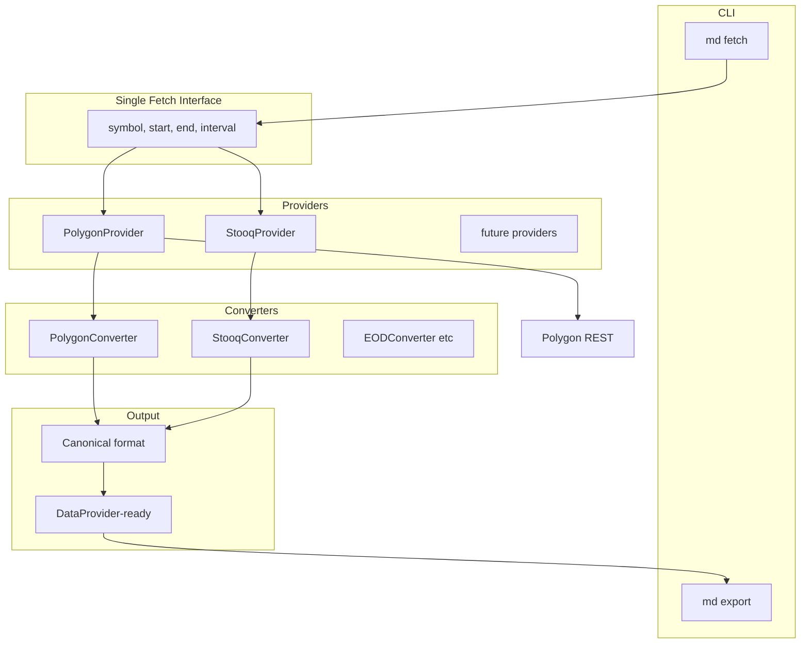

# CLI Market Data Fetch — Polygon Default Provider (EOD)

## Goal

Build a CLI that fetches daily OHLCV (or OHLC where volume is not meaningful) on demand for backtesting. One unified fetch interface regardless of provider; multiple providers (Polygon default) and multiple converters to produce canonical DataProvider-ready format.

## Architecture

**Single fetch interface** — same call (symbol, start, end, interval) regardless of provider. Providers return raw format; converters transform to canonical format.



- **Providers**: Fetch from sources (Polygon default, Stooq, others). Each returns provider-specific raw format.
- **Converters**: Transform raw format → canonical (ts, open, high, low, close, volume) compatible with DataProvider.


## Package Layout

```
src/marketdata/
  __init__.py
  cli.py           # Entry: md fetch, md export
  config.py        # Paths, defaults
  providers/
    __init__.py
    base.py        # MarketDataProvider ABC
    polygon.py     # PolygonProvider (default)
    stooq.py       # (optional, phase 6)
  converters/
    __init__.py
    base.py        # FormatConverter ABC
    polygon.py     # PolygonConverter
    stooq.py       # StooqConverter
  symbols.py       # Symbol mapping from symbols.yaml
  storage.py       # Read/write cache + metadata
  validate.py      # Hard/soft validation
  export.py        # Split and write CSVs
  symbols.yaml     # Bundled in package
```

## Provider Interface

Single interface regardless of provider:

```python
# providers/base.py
class MarketDataProvider(ABC):
    @abstractmethod
    def get_ohlcv_raw(self, symbol: str, start: date, end: date, interval: str) -> Any:
        """Returns provider-specific raw data (DataFrame, dict, etc.)."""
```

## Converter Interface

Converters transform raw provider output to canonical format:

```python
# converters/base.py
class FormatConverter(ABC):
    @abstractmethod
    def to_canonical(self, raw: Any) -> pd.DataFrame:
        """Returns canonical DataFrame: ts (datetime UTC), open, high, low, close, volume.
        Compatible with DataProvider underlying bar format."""
```

## Canonical Format (DataProvider-ready)

- **Columns**: ts, open, high, low, close, volume
- **ts**: ISO datetime UTC (bar close time)
- **File naming**: `{symbol}_{interval}.csv` (e.g. SPX_1d.csv)

## Symbol Mapping

- **Config**: `src/marketdata/symbols.yaml` (bundled) — user symbol → provider symbol
- **Registry**: `symbols.resolve(user_symbol, provider)` loads YAML, CLI resolves
- **Polygon indices**: Use `I:SPX` format; store in mapping

Example `symbols.yaml`:

```yaml
polygon:
  SPX: I:SPX
  NDX: I:NDX
  SPY: SPY   # stocks need no prefix
stooq:
  SPX: ^SPX
  SPY: SPY.US
```

## Polygon Provider

- **Auth**: `POLYGON_API_KEY` env var; fail with clear error if missing
- **Endpoint**: `GET /v2/aggs/ticker/{ticker}/range/1/day/{from}/{to}`
  - Ref: [https://polygon.io/docs/indices/get_v2_aggs_ticker__indicesticker__range__multiplier___timespan___from___to](https://polygon.io/docs/indices/get_v2_aggs_ticker__indicesticker__range__multiplier___timespan___from___to)
- **Indices**: No volume in response; set Volume to None/NaN
- **Date format**: YYYY-MM-DD for from/to
- **Pagination**: Handle limit 5000; split range if needed

## Caching

- **Path**: `./data/cache/{provider}/{interval}/{symbol}/bars_{start}_{end}.parquet`
- **Content**: Canonical format (after converter) — ready for export/DataProvider
- **Metadata**: Same path + `.meta.json`:
  - provider, user_symbol, provider_symbol, interval, start, end, fetched_at (UTC), source, notes
- **Key**: provider + provider_symbol + interval + start + end

## Validation (validate.py)

**Hard checks (canonical format):**

- Required columns: ts, open, high, low, close, volume
- No duplicate timestamps
- Timestamps strictly increasing
- OHLC: High >= max(O,C), Low <= min(O,C), Low <= High

**Soft (warnings):**

- Volume missing/zero-heavy (expected for indices)
- Gaps for non-trading days

## Export

- **Input**: canonical format (from converter)
- **Filter**: inclusive start, exclusive end `[start, end)`
- **Split modes**: none | month | quarter | year
- **Monthly naming**: `{symbol}_{YYYY}_{MM}.csv` (e.g. spx_2010_01.csv)
- **Schema**: ts (ISO UTC), Open, High, Low, Close, Volume — DataProvider-ready

## CLI Commands

### md fetch

```
md fetch --provider polygon --symbol SPX --interval 1d --start 2010-01-01 --end 2011-01-01
```

- Fetches from Polygon
- Writes Parquet + .meta.json to cache
- Uses symbol mapping for provider ticker

### md export

```
md export --provider polygon --symbol SPX --interval 1d --start 2010-01-01 --end 2011-01-01 --split month --out ./data/exports/spx/2010
```

- Reads cache (or fetches if missing, unless `--no-fetch`)
- Validates
- Exports 12 CSVs for 2010

## Build Order (MVP)

1. **CLI skeleton** — argparse subparsers for `fetch` and `export`; config paths
2. **PolygonProvider** — `get_ohlcv_raw` with REST call; env POLYGON_API_KEY
3. **PolygonConverter** — raw → canonical (ts, OHLCV)
4. **Storage** — write/read Parquet + metadata (canonical format)
5. **Validation** — hard checks in validate.py
6. **Export** — split month, write CSVs (DataProvider-ready)
7. **StooqProvider + StooqConverter** — optional fallback (only if needed)

## Dependencies

- `pyproject.toml`: add `requests`, `pyyaml`, `pyarrow` (parquet)
- Script: `[project.scripts] md = "src.marketdata.cli:main"`
- Package: `src/marketdata` (under src)

## Done Criteria

Running:

```bash
md export --provider polygon --symbol SPX --interval 1d --start 2010-01-01 --end 2011-01-01 --split month --out ./data/exports/spx/2010
```

creates 12 CSV files (spx_2010_01.csv … spx_2010_12.csv) with correct months and trading days only.
