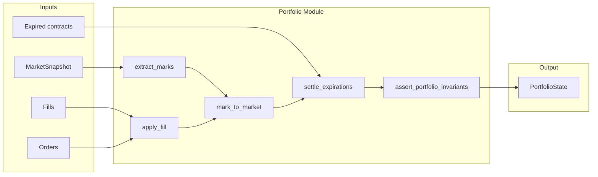

# 050: Portfolio Accounting + Marking (Red-Green-Refactor)

Conforms to [001_mvp_implementation_roadmap.md](001_mvp_implementation_roadmap.md) Step 4, [000_options_backtester_mvp.md](000_options_backtester_mvp.md) M7 and 000 §6 invariants.

---

## Objective

Implement portfolio accounting and marking so that:

- Positions and cash update **only from fills** (A1)
- Mark-to-market runs at each simulation step
- Realized/unrealized P&L and equity are computed
- Expiration settlement (simplified) at intrinsic value
- Invariants hold at every step

---

## Existing Foundation

| Artifact         | Location                                           | Usage                                                      |
| ---------------- | -------------------------------------------------- | ---------------------------------------------------------- |
| `PortfolioState` | [src/domain/portfolio.py](../src/domain/portfolio.py) | cash, positions, realized_pnl, unrealized_pnl, equity      |
| `Position`       | [src/domain/position.py](../src/domain/position.py)   | instrument_id, qty, avg_price, multiplier, instrument_type |
| `Fill`           | [src/domain/fill.py](../src/domain/fill.py)           | order_id, ts, fill_price, fill_qty, fees                   |
| `Order`          | [src/domain/order.py](../src/domain/order.py)         | instrument_id, side, qty                                   |
| `MarketSnapshot` | [src/domain/snapshot.py](../src/domain/snapshot.py)   | underlying_bar, option_quotes (Quotes)                     |
| `Quotes`         | [src/domain/quotes.py](../src/domain/quotes.py)       | quotes: dict[str, Quote] — bid, ask, mid per contract      |
| `BarRow`         | [src/domain/bars.py](../src/domain/bars.py)           | close price for underlying                                 |

**Fill lacks `instrument_id`** — portfolio must receive `(fill, order)` to apply. `Order.instrument_id` provides instrument; `Order.side` determines qty sign. Multiplier and instrument_type: MVP default `multiplier=100`, `instrument_type="option"` (configurable later).

---

## Invariants (000 §6 — must assert)

1. `portfolio.equity == portfolio.cash + sum(mark_value(position))` within tolerance (e.g. 0.01)
2. No NaNs in cash, equity, realized_pnl, unrealized_pnl
3. Option quantities are integers (Position.qty)
4. Multipliers applied exactly once

---

## Module Layout

```
src/portfolio/
  __init__.py       # exports apply_fill, mark_to_market, settle_expirations, assert_portfolio_invariants
  accounting.py     # core logic (pure functions)
  tests/
    __init__.py
    test_accounting.py
```

---

## Implementation Phases

### Phase 1: Apply fill to portfolio

| Stage        | Tasks                                                                                                                                                                                                                                                                                                                               |
| ------------ | ----------------------------------------------------------------------------------------------------------------------------------------------------------------------------------------------------------------------------------------------------------------------------------------------------------------------------------- |
| **Red**      | Write tests in `src/portfolio/tests/test_accounting.py`: `apply_fill(portfolio, fill, order) -> PortfolioState` — buy opens long position (cash decreases, position added); sell closes/reduces or opens short; fees reduce cash; realized P&L on close; avg_price updates on add; assert invariant after apply                     |
| **Green**    | Implement `apply_fill` in `src/portfolio/accounting.py`. Signature: `def apply_fill(portfolio: PortfolioState, fill: Fill, order: Order, *, multiplier: float = 100.0, instrument_type: str = "option") -> PortfolioState`. Return new PortfolioState (immutable). Use `order.instrument_id` and `order.side` to derive signed qty. |
| **Refactor** | Extract helpers (e.g. cost basis merge) if needed; ensure no mutation                                                                                                                                                                                                                                                               |


### Phase 2: Mark-to-market and equity

| Stage        | Tasks                                                                                                                                                                                                                                                                                                      |
| ------------ | ---------------------------------------------------------------------------------------------------------------------------------------------------------------------------------------------------------------------------------------------------------------------------------------------------------- |
| **Red**      | Tests: `mark_to_market(portfolio, marks: dict[str, float]) -> PortfolioState` — compute per-position mark value (`qty * mark * multiplier`); sum to total position value; unrealized_pnl = total_mark_value - total_cost_basis; equity = cash + total_mark_value; realized_pnl unchanged; assert invariant |
| **Green**    | Implement `mark_to_market`. Marks map `instrument_id -> price`. Handle missing marks (skip or use prior; document behavior).                                                                                                                                                                               |
| **Refactor** | Share mark_value computation; add tolerance constant for float comparison                                                                                                                                                                                                                                  |


### Phase 3: Extract marks from MarketSnapshot

| Stage        | Tasks                                                                                                                                                                                                                       |
| ------------ | --------------------------------------------------------------------------------------------------------------------------------------------------------------------------------------------------------------------------- |
| **Red**      | Tests: `extract_marks(snapshot: MarketSnapshot, symbol: str) -> dict[str, float]` — options: use Quote.mid or (bid+ask)/2 per contract; underlying: use underlying_bar.close for symbol; handle None bars/quotes gracefully |
| **Green**    | Implement `extract_marks` (can live in `accounting.py` or `src/portfolio/marks.py`).                                                                                                                                        |
| **Refactor** | Clear separation between mark extraction and marking logic                                                                                                                                                                  |


### Phase 4: Invariant assertions

| Stage        | Tasks                                                                                                                                                                    |
| ------------ | ------------------------------------------------------------------------------------------------------------------------------------------------------------------------ |
| **Red**      | Tests: `assert_portfolio_invariants(portfolio, tolerance=0.01)` — raises if equity != cash + sum(mark_value); if any NaN in cash/equity/pnl; if any position qty not int |
| **Green**    | Implement `assert_portfolio_invariants`. Used after apply_fill and mark_to_market in engine loop.                                                                        |
| **Refactor** | Optional: return list of violations instead of raising; keep simple raise for MVP                                                                                        |


### Phase 5: Expiration settlement (simplified)

| Stage        | Tasks                                                                                                                                                                                                                                                                                                               |
| ------------ | ------------------------------------------------------------------------------------------------------------------------------------------------------------------------------------------------------------------------------------------------------------------------------------------------------------------- |
| **Red**      | Tests: `settle_expirations(portfolio, ts, expired: dict[str, float]) -> PortfolioState` — for each instrument_id in expired, intrinsic_value per contract; close position; cash settlement = qty * intrinsic_value * multiplier (short pays, long receives); remove position; update realized_pnl; assert invariant |
| **Green**    | Implement `settle_expirations`. `expired` maps contract_id -> intrinsic_value (caller provides from ContractSpec + underlying close at expiry).                                                                                                                                                                     |
| **Refactor** | Document that early assignment is out of scope (config flag later)                                                                                                                                                                                                                                                  |


---

## Data Flow (engine loop usage)



---

## Key Design Decisions

| Decision                                         | Rationale                                                                     |
| ------------------------------------------------ | ----------------------------------------------------------------------------- |
| `apply_fill(portfolio, fill, order)`             | Fill lacks instrument_id; Order provides it. Keeps Fill minimal.              |
| Default multiplier=100, instrument_type="option" | MVP is options-only; configurable later for minis/underlying.                 |
| Pure functions returning new PortfolioState      | Immutable; easier testing and audit.                                          |
| Marks from caller as dict                        | Decouples accounting from DataProvider; engine assembles marks from snapshot. |
| Expiration: caller provides intrinsic values     | ContractSpec + underlying close at expiry; engine computes and passes.        |


---

## Acceptance Criteria

- `apply_fill` correctly updates cash, positions, realized_pnl for buys/sells
- `mark_to_market` correctly computes unrealized_pnl and equity
- `extract_marks` derives marks from MarketSnapshot (options + underlying)
- `assert_portfolio_invariants` catches equity mismatch, NaN, non-integer qty
- `settle_expirations` closes expired positions with cash settlement
- All phases follow Red -> Green -> Refactor
- Unit tests in `src/portfolio/tests/`; no implementation before tests
