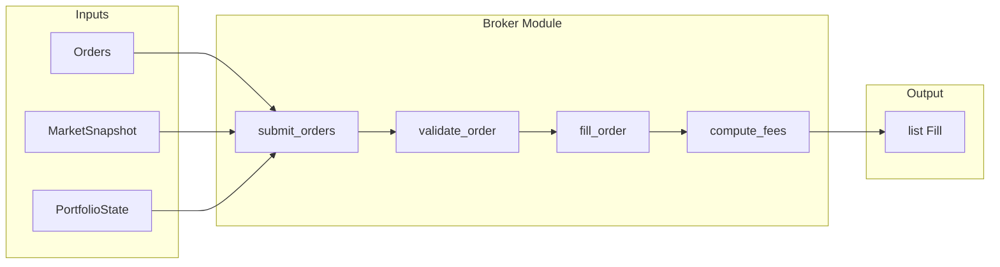

# 060: Broker + FillModel + FeeModel (Red-Green-Refactor)

Conforms to [001_mvp_implementation_roadmap.md](001_mvp_implementation_roadmap.md) Step 5, [000_options_backtester_mvp.md](000_options_backtester_mvp.md) M4, M5, M6.

---

## Objective

Implement Broker, FillModel, and FeeModel so that:

- Orders are validated (basic sanity checks)
- FeeModel applies per-contract and per-order fees
- FillModel produces fills (quote-based: buy at ask, sell at bid; or synthetic spread when mid-only)
- `submit_orders(orders, snapshot, portfolio) -> list[Fill]`

---

## Existing Foundation

| Artifact         | Location                                           | Usage                                                      |
| ---------------- | -------------------------------------------------- | ---------------------------------------------------------- |
| `Order`          | [src/domain/order.py](../src/domain/order.py)      | id, ts, instrument_id, side, qty, order_type, limit_price, tif |
| `Fill`           | [src/domain/fill.py](../src/domain/fill.py)         | order_id, ts, fill_price, fill_qty, fees, liquidity_flag   |
| `MarketSnapshot` | [src/domain/snapshot.py](../src/domain/snapshot.py) | underlying_bar, option_quotes (Quotes)                     |
| `Quotes`         | [src/domain/quotes.py](../src/domain/quotes.py)     | quotes: dict[str, Quote | QuoteStatus | None] — bid, ask, mid per contract |
| `Quote`          | [src/domain/quotes.py](../src/domain/quotes.py)     | bid, ask, mid (crossed markets sanitized)                  |
| `PortfolioState` | [src/domain/portfolio.py](../src/domain/portfolio.py) | cash, positions, realized_pnl, unrealized_pnl, equity      |
| `extract_marks`  | [src/portfolio/accounting.py](../src/portfolio/accounting.py) | snapshot -> dict[str, float] for marks           |

**Instrument availability**: Options from `snapshot.option_quotes.quotes` keys; underlying from `snapshot.underlying_bar` (symbol matches). **Buying-power estimate**: mark * qty * multiplier (mark from extract_marks).

---

## Invariants (000 §6 — must assert)

- Every fill references a valid order_id
- Rejected orders produce no Fill

---

## Module Layout

```
src/broker/
  __init__.py       # exports validate_order, submit_orders, compute_fees, fill_order
  broker.py         # submit_orders, validate_order
  fill_model.py     # fill_order (quote-based + synthetic)
  fee_model.py      # compute_fees
  tests/
    __init__.py
    test_validation.py
    test_fee_model.py
    test_fill_model.py
    test_broker.py
```

---

## Implementation Phases

### Phase 1: Order Validation

| Stage        | Tasks                                                                                                                                                                                                                                                                                                                               |
| ------------ | ----------------------------------------------------------------------------------------------------------------------------------------------------------------------------------------------------------------------------------------------------------------------------------------------------------------------------------- |
| **Red**      | Tests in `src/broker/tests/test_validation.py`: `validate_order` rejects unknown instrument (not in snapshot option_quotes/symbol); rejects qty <= 0; rejects BUY when estimated cost (mark * qty * multiplier) exceeds cash; accepts valid order. Unblock and implement [tests/integration/test_portfolio.py](../tests/integration/test_portfolio.py) stubs: `test_order_validation_rejects_unknown_instrument`, `test_order_validation_rejects_negative_qty`, `test_order_validation_rejects_insufficient_buying_power`, `test_order_validation_accepts_valid_order`. |
| **Green**    | Implement `validate_order(order, snapshot, portfolio, *, symbol: str, multiplier: float = 100.0) -> bool`. Use `snapshot.option_quotes.quotes` and `snapshot.underlying_bar` to check instrument availability; `extract_marks` for cost estimate.                                                                                                                                                    |
| **Refactor** | Extract per-rule helpers; document buying-power estimate (mark-based).                                                                                                                                                                                                                                                               |


### Phase 2: FeeModel

| Stage        | Tasks                                                                                                                                                                                         |
| ------------ | --------------------------------------------------------------------------------------------------------------------------------------------------------------------------------------------- |
| **Red**      | Tests: `compute_fees(order, fill, fee_config) -> float`. Per-contract fee (e.g. 0.65) + per-order fee (e.g. 0.50). Add `FeeModelConfig` dataclass with `per_contract`, `per_order`.            |
| **Green**    | Implement `compute_fees` in `src/broker/fee_model.py`. Fee config passed as parameter (BacktestConfig integration later).                                                                     |
| **Refactor** | Add to BacktestConfig/run manifest for reproducibility (optional in this phase).                                                                                                               |


### Phase 3: FillModel – Quote-Based

| Stage        | Tasks                                                                                                                                                                                                                                                                 |
| ------------ | --------------------------------------------------------------------------------------------------------------------------------------------------------------------------------------------------------------------------------------------------------------------- |
| **Red**      | Tests: `fill_order(order, snapshot, *, fill_config) -> Fill | None`. When Quote exists with bid/ask: BUY fills at ask, SELL fills at bid. Handle `Quote` vs `QuoteStatus`; return None when quote invalid. Unblock `test_fillmodel_quote_based_buy_fills_at_ask`, `test_fillmodel_quote_based_sell_fills_at_bid`, `test_fillmodel_fill_qty_matches_order`. |
| **Green**    | Implement `fill_order` in `src/broker/fill_model.py`. Return `Fill(order_id=order.id, ts=snapshot.ts, fill_price=ask|bid, fill_qty=order.qty, fees=0.0)`.                                             |
| **Refactor** | Clear handling of missing/stale quotes; return None when quote invalid.                                                                                                                                                                                              |


### Phase 4: FillModel – Synthetic Spread

| Stage        | Tasks                                                                                                                                                                                                                  |
| ------------ | ---------------------------------------------------------------------------------------------------------------------------------------------------------------------------------------------------------------------- |
| **Red**      | Tests: When only `Quote.mid` (or no bid/ask): BUY at `mid + spread/2`, SELL at `mid - spread/2`. Config: `synthetic_spread_bps` or `synthetic_spread_ticks`. Unblock `test_fillmodel_synthetic_spread_when_no_quotes`.     |
| **Green**    | Implement synthetic path in `fill_order`. Fallback when bid/ask absent; use configurable spread.                                                                                                                        |
| **Refactor** | Document spread semantics; optional: underlying uses bar close as mid.                                                                                                                                                 |


### Phase 5: Broker submit_orders

| Stage        | Tasks                                                                                                                                                                                                                                       |
| ------------ | ------------------------------------------------------------------------------------------------------------------------------------------------------------------------------------------------------------------------------------------- |
| **Red**      | Tests: `submit_orders(orders, snapshot, portfolio, *, symbol, fee_config, fill_config) -> list[Fill]`. For each order: validate; if valid, fill_order; if fill, compute_fees and attach; collect. Integration test with real DataProvider snapshot. |
| **Green**    | Implement `submit_orders` in `src/broker/broker.py`. Orchestrate validate -> fill_order -> compute_fees. Ensure every returned Fill has valid order_id (invariant).                                                                         |
| **Refactor** | Export from `src/broker/__init__.py`; wire config; update integration tests to use Broker.                                                                                                                                                  |


---

## Data Flow



---

## Key Design Decisions

| Decision                                               | Rationale                                                                        |
| ------------------------------------------------------ | -------------------------------------------------------------------------------- |
| `validate_order` before fill                           | 000 M4: validate first; rejected orders produce no Fill.                         |
| FillModel returns Fill with fees=0; FeeModel adds fees | Clean separation; Broker combines them.                                         |
| Instrument availability from snapshot                  | option_quotes.quotes keys = available option contracts; underlying_bar = symbol. |
| Buying-power estimate from marks                       | Fill price unknown until FillModel; use mark * qty * multiplier for pre-check.    |
| Pure functions / immutable                             | Matches portfolio module style; testable.                                        |


---

## Acceptance Criteria

- `validate_order` rejects unknown instrument, qty <= 0, insufficient buying power; accepts valid
- `compute_fees` returns per-contract + per-order fees
- `fill_order` fills BUY at ask, SELL at bid when quotes available; synthetic spread when mid-only
- `submit_orders` orchestrates validate -> fill_order -> compute_fees; returns list[Fill]
- All phases follow Red -> Green -> Refactor
- Unit tests in `src/broker/tests/`; integration tests in `tests/integration/test_portfolio.py` unblocked
