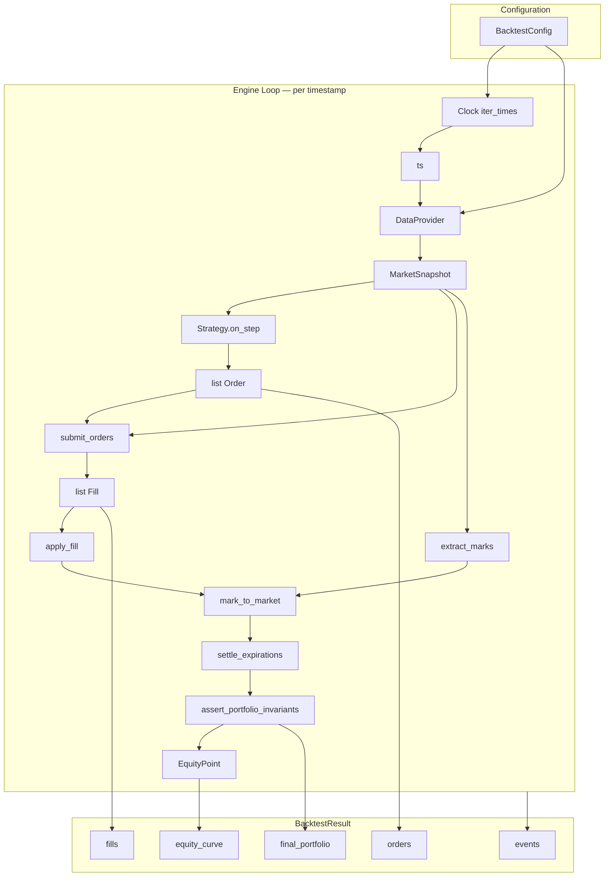

# 070: Backtest Engine Loop (Red-Green-Refactor)

Conforms to [001_mvp_implementation_roadmap.md](001_mvp_implementation_roadmap.md) Step 6, [000_options_backtester_mvp.md](000_options_backtester_mvp.md) A3 and M3.

---

## Objective

Wire all existing modules into the A3 clock-driven simulation loop:

- **Clock** yields bar-close timestamps
- **DataProvider** builds `MarketSnapshot` at each ts (underlying bar + option quotes for active chain)
- **Strategy** receives snapshot + portfolio view, emits `Order`s
- **Broker** validates and fills orders via FillModel + FeeModel
- **Portfolio** applies fills, marks-to-market, settles expirations, asserts invariants
- **Events** logged at each step (MARKET, ORDER, FILL, LIFECYCLE)
- **BacktestResult** collects equity curve, all orders, fills, events, final portfolio

---

## Existing Foundation

| Artifact            | Location                                                         | Usage                                                                  |
| ------------------- | ---------------------------------------------------------------- | ---------------------------------------------------------------------- |
| `iter_times`        | [src/clock/clock.py](../src/clock/clock.py)                      | `iter_times(start, end, timeframe_base)` yields bar-close datetimes    |
| `LocalFileDataProvider` | [src/loader/provider.py](../src/loader/provider.py)          | `get_underlying_bars`, `get_option_chain`, `get_option_quotes`, `get_contract_metadata` |
| `build_market_snapshot` | [src/domain/snapshot.py](../src/domain/snapshot.py)          | `build_market_snapshot(ts, bar, quotes)` → MarketSnapshot              |
| `submit_orders`     | [src/broker/broker.py](../src/broker/broker.py)                  | `submit_orders(orders, snapshot, portfolio, *, symbol, fee_config, fill_config)` → list[Fill] |
| `validate_order`    | [src/broker/broker.py](../src/broker/broker.py)                  | Pre-trade validation (instrument availability, buying power)           |
| `apply_fill`        | [src/portfolio/accounting.py](../src/portfolio/accounting.py)    | `apply_fill(portfolio, fill, order)` → PortfolioState                  |
| `mark_to_market`    | [src/portfolio/accounting.py](../src/portfolio/accounting.py)    | `mark_to_market(portfolio, marks)` → PortfolioState                    |
| `extract_marks`     | [src/portfolio/accounting.py](../src/portfolio/accounting.py)    | `extract_marks(snapshot, symbol)` → dict[str, float]                   |
| `settle_expirations`| [src/portfolio/accounting.py](../src/portfolio/accounting.py)    | `settle_expirations(portfolio, ts, expired)` → PortfolioState          |
| `assert_portfolio_invariants` | [src/portfolio/accounting.py](../src/portfolio/accounting.py) | Raises on equity mismatch, NaN, non-int qty                    |
| `BacktestConfig`    | [src/domain/config.py](../src/domain/config.py)                  | symbol, start, end, timeframe_base, data_provider_config, seed         |
| `Event` / `EventType` | [src/domain/event.py](../src/domain/event.py)                 | ts, type (MARKET/ORDER/FILL/LIFECYCLE), payload                        |
| `Order`             | [src/domain/order.py](../src/domain/order.py)                    | Frozen: id, ts, instrument_id, side, qty, order_type, limit_price, tif |
| `Fill`              | [src/domain/fill.py](../src/domain/fill.py)                      | order_id, ts, fill_price, fill_qty, fees, liquidity_flag               |
| `PortfolioState`    | [src/domain/portfolio.py](../src/domain/portfolio.py)            | cash, positions, realized_pnl, unrealized_pnl, equity                  |
| `ContractSpec`      | [src/domain/contract.py](../src/domain/contract.py)              | contract_id, underlying_symbol, strike, expiry, right, multiplier      |
| `FeeModelConfig`    | [src/broker/fee_model.py](../src/broker/fee_model.py)            | per_contract, per_order                                                |
| `FillModelConfig`   | [src/broker/fill_model.py](../src/broker/fill_model.py)          | synthetic_spread_bps                                                   |

---

## Invariants (000 §6 — must assert at every step)

- `portfolio.equity == portfolio.cash + sum(mark_value(position))` within tolerance
- No NaNs in cash/equity/pnl
- Option quantities are integers
- Every fill references a valid order_id
- Determinism: same config + strategy + data + seed → identical BacktestResult (A5)

---

## New Concepts Introduced

### Strategy ABC (M3)

Abstract base class. Strategy has no side effects; receives snapshot + portfolio state view, returns orders.

```python
class Strategy(ABC):
    @abstractmethod
    def on_step(self, snapshot: MarketSnapshot, state_view: PortfolioState) -> list[Order]: ...
```

### BacktestResult

Container for all engine outputs. Enables Reporter (Step 7) and golden test (Step 8).

```python
@dataclass
class EquityPoint:
    ts: datetime
    equity: float

@dataclass
class BacktestResult:
    config: BacktestConfig
    equity_curve: list[EquityPoint]
    orders: list[Order]
    fills: list[Fill]
    events: list[Event]
    final_portfolio: PortfolioState
```

### BacktestConfig Extensions

Add fields needed for engine wiring (with defaults to preserve backward compat):

- `initial_cash: float = 100_000.0`
- `fee_config: FeeModelConfig | None = None` (None → zero fees)
- `fill_config: FillModelConfig | None = None` (None → default synthetic spread)

Update `to_dict` / `from_dict` to include new fields.

---

## Module Layout

```
src/engine/
  __init__.py          # exports run_backtest, BacktestResult, EquityPoint, Strategy
  engine.py            # run_backtest orchestration
  result.py            # BacktestResult, EquityPoint
  strategy.py          # Strategy ABC, NullStrategy (test helper)
  tests/
    __init__.py
    test_strategy.py   # Phase 1 tests
    test_result.py     # Phase 2 tests
    test_engine.py     # Phase 4, 5 tests
```

Tests for BacktestConfig extensions go in existing `src/domain/tests/test_config.py`.

Integration tests go in `tests/integration/test_engine.py` (Phase 6).

---

## Implementation Phases

### Phase 1: Strategy ABC

| Stage        | Tasks                                                                                                                                                                                                                                                                                                             |
| ------------ | ----------------------------------------------------------------------------------------------------------------------------------------------------------------------------------------------------------------------------------------------------------------------------------------------------------------- |
| **Red**      | Tests in `src/engine/tests/test_strategy.py`: (1) `Strategy` cannot be instantiated (ABC). (2) Subclass that implements `on_step` can be instantiated. (3) `NullStrategy().on_step(snapshot, portfolio)` returns empty list. (4) `on_step` signature accepts `MarketSnapshot` and `PortfolioState`, returns `list[Order]`. |
| **Green**    | Implement `Strategy` ABC in `src/engine/strategy.py`. `on_step(self, snapshot: MarketSnapshot, state_view: PortfolioState) -> list[Order]`. Implement `NullStrategy` (returns `[]`). |
| **Refactor** | Docstrings with reasoning; export from `src/engine/__init__.py`.                                                                                                                                                                                                                                                  |


### Phase 2: BacktestResult + EquityPoint

| Stage        | Tasks                                                                                                                                                                                                                                        |
| ------------ | -------------------------------------------------------------------------------------------------------------------------------------------------------------------------------------------------------------------------------------------- |
| **Red**      | Tests in `src/engine/tests/test_result.py`: (1) `EquityPoint` holds ts + equity. (2) `BacktestResult` holds config, equity_curve, orders, fills, events, final_portfolio. (3) Empty result (no trades) is valid. (4) Fields have correct types. |
| **Green**    | Implement `EquityPoint` and `BacktestResult` dataclasses in `src/engine/result.py`.                                                                                                                                                          |
| **Refactor** | Docstrings with reasoning; export from `__init__.py`.                                                                                                                                                                                        |


### Phase 3: BacktestConfig Extensions

| Stage        | Tasks                                                                                                                                                                                                                                                                                                             |
| ------------ | ----------------------------------------------------------------------------------------------------------------------------------------------------------------------------------------------------------------------------------------------------------------------------------------------------------------- |
| **Red**      | Tests in `src/domain/tests/test_config.py`: (1) `BacktestConfig` accepts `initial_cash`, `fee_config`, `fill_config`. (2) Defaults: `initial_cash=100_000.0`, fee/fill config `None`. (3) `to_dict` includes new fields. (4) `from_dict` round-trips new fields. (5) Existing tests still pass (backward compat). |
| **Green**    | Add `initial_cash: float = 100_000.0`, `fee_config: FeeModelConfig | None = None`, `fill_config: FillModelConfig | None = None` to `BacktestConfig`. Update `to_dict`/`from_dict`. Import `FeeModelConfig`, `FillModelConfig` in `src/domain/config.py`.                                                         |
| **Refactor** | Verify all existing config tests pass; clean up serialization logic.                                                                                                                                                                                                                                              |


### Phase 4: Engine Core Loop

This is the central phase. The engine function iterates Clock timestamps, builds snapshots, calls strategy, submits orders via Broker, applies fills, marks portfolio, asserts invariants, and emits events.

| Stage        | Tasks                                                                                                                                                                                                                                                                                                                                                                                         |
| ------------ | --------------------------------------------------------------------------------------------------------------------------------------------------------------------------------------------------------------------------------------------------------------------------------------------------------------------------------------------------------------------------------------------- |
| **Red**      | Tests in `src/engine/tests/test_engine.py` using `NullStrategy` and mock/stub DataProvider: (1) `run_backtest(config, strategy, provider)` returns `BacktestResult`. (2) With `NullStrategy`: no fills, no orders, equity constant at `initial_cash` throughout. (3) Equity curve has one `EquityPoint` per Clock timestamp. (4) MARKET events emitted at each step. (5) `final_portfolio.cash == initial_cash`. (6) Invariants hold at every step (no assertion errors). |
| **Green**    | Implement `run_backtest(config: BacktestConfig, strategy: Strategy, provider: DataProvider) -> BacktestResult` in `src/engine/engine.py`. Loop: `for ts in iter_times(config.start, config.end, config.timeframe_base)`: get underlying bar, get option chain, get option quotes, build snapshot, call `strategy.on_step`, `submit_orders`, `apply_fill` each fill, `extract_marks`, `mark_to_market`, `assert_portfolio_invariants`, emit events, append equity point. |
| **Refactor** | Extract `_build_step_snapshot`, `_process_orders`, `_emit_step_events` helpers to keep `run_backtest` under 40 lines. Export from `__init__.py`.                                                                                                                                                                                                                                              |


### Phase 4b: Engine with Order Flow

| Stage        | Tasks                                                                                                                                                                                                                                                                                                                                                                                |
| ------------ | ------------------------------------------------------------------------------------------------------------------------------------------------------------------------------------------------------------------------------------------------------------------------------------------------------------------------------------------------------------------------------------ |
| **Red**      | Tests in `src/engine/tests/test_engine.py` using a `BuyOnceStrategy` (buys 1 contract on first step, then no-ops): (1) Exactly 1 fill produced. (2) Portfolio has position after first step. (3) Equity changes after fill. (4) ORDER event emitted on step 1. (5) FILL event emitted on step 1. (6) Fill references valid order_id. (7) `final_portfolio` reflects the position. Uses fixture-based DataProvider or in-memory stub. |
| **Green**    | Ensure order flow is wired: `strategy.on_step` → orders collected → `submit_orders` → fills → `apply_fill` for each (with order lookup) → events. `BuyOnceStrategy` implemented as test helper (not exported).                                                                                                                                                                       |
| **Refactor** | Ensure order-to-fill lookup is clean (dict by order_id). Verify event payloads contain useful data (order_id, fill_price, instrument_id).                                                                                                                                                                                                                                            |


### Phase 5: Expiration Detection and Settlement

| Stage        | Tasks                                                                                                                                                                                                                                                                                                                                                          |
| ------------ | -------------------------------------------------------------------------------------------------------------------------------------------------------------------------------------------------------------------------------------------------------------------------------------------------------------------------------------------------------------- |
| **Red**      | Tests in `src/engine/tests/test_engine.py`: (1) Position held past contract expiry date is settled. (2) After settlement: position removed, cash adjusted, realized_pnl updated. (3) LIFECYCLE event emitted with settlement details. (4) Invariants hold after settlement. Uses a strategy that buys a contract expiring within the test date range. |
| **Green**    | In the engine loop, after mark-to-market: check each position's `instrument_id` via `provider.get_contract_metadata` for expiry. If `expiry <= ts.date()`: compute intrinsic value (call price − strike for calls, strike − put for puts, from underlying bar close), build `expired` dict, call `settle_expirations`. Emit LIFECYCLE event. |
| **Refactor** | Extract `_detect_expirations` and `_compute_intrinsic_values` helpers. Cache contract metadata to avoid repeated lookups. Document that early assignment is out of scope.                                                                                                                                                                                       |


### Phase 6: Integration Tests (after initial implementation)

These tests exercise the full engine with real `LocalFileDataProvider` and fixture data. Created **after** Phases 1–5 are green.

| Stage        | Tasks                                                                                                                                                                                                                                                                                     |
| ------------ | ----------------------------------------------------------------------------------------------------------------------------------------------------------------------------------------------------------------------------------------------------------------------------------------- |
| **Red**      | Tests in `tests/integration/test_engine.py` (details below).                                                                                                                                                                                                                              |
| **Green**    | All integration tests pass with the engine implementation from Phases 1–5.                                                                                                                                                                                                                |
| **Refactor** | Shared helpers (e.g., `_make_engine_config`) extracted; consistent assertion style.                                                                                                                                                                                                        |

#### Integration Test Specifications

All tests use `@pytest.mark.integration` and the shared `provider` / `provider_config` fixtures from `tests/integration/conftest.py`.

| # | Test Name                                        | Purpose                                                                                                                                                                 |
|---|--------------------------------------------------|-------------------------------------------------------------------------------------------------------------------------------------------------------------------------|
| 1 | `test_engine_null_strategy_no_trades`            | `NullStrategy` over 1-minute range. No fills, no orders. Equity constant at `initial_cash`. Equity curve length matches Clock tick count. MARKET events emitted.         |
| 2 | `test_engine_determinism`                        | Run same config + `NullStrategy` twice. Equity curves identical. Event lists identical. A5 invariant.                                                                    |
| 3 | `test_engine_buy_once_produces_fill`             | `BuyOnceStrategy` buys SPY\|2026-01-17\|C\|480\|100 on first step. Exactly 1 fill. Portfolio has position. Fill price matches ask. ORDER + FILL events present.          |
| 4 | `test_engine_buy_sell_roundtrip`                 | `BuySellStrategy` buys step 1, sells step 2. Realized P&L nonzero. Position removed after sell. Invariants hold at every step.                                           |
| 5 | `test_engine_fees_reduce_cash`                   | Config with `FeeModelConfig(per_contract=0.65, per_order=0.50)`. After fill, cash reduced by cost + fees. Fees visible in fill object.                                   |
| 6 | `test_engine_invariants_hold_every_step`         | Multi-step run with `BuyOnceStrategy`. Verify equity invariant at every equity point (equity == cash + sum(mark_value)). No NaN. Integer qty.                            |
| 7 | `test_engine_equity_curve_reflects_marking`      | After buying option, equity curve values change as marks change across timestamps (if underlying bar prices differ across fixture rows).                                  |
| 8 | `test_engine_all_fills_reference_valid_orders`   | After run, `all(f.order_id in {o.id for o in result.orders} for f in result.fills)`. 000 §6 invariant.                                                                  |

---

## A3 Loop — Step-by-Step (reference for implementation)

```
initialize portfolio = PortfolioState(cash=config.initial_cash, ...)
for ts in iter_times(config.start, config.end, config.timeframe_base):
    1. bar = provider.get_underlying_bars(symbol, timeframe, ts, ts).rows[0] or None
    2. chain = provider.get_option_chain(symbol, ts)
    3. quotes = provider.get_option_quotes(chain, ts)
    4. snapshot = build_market_snapshot(ts, bar, quotes)
    5. emit MARKET event
    6. orders = strategy.on_step(snapshot, portfolio)
    7. emit ORDER events for each order
    8. fills = submit_orders(orders, snapshot, portfolio, symbol=symbol, fee_config=..., fill_config=...)
    9. for fill in fills:
         order = orders_by_id[fill.order_id]
         portfolio = apply_fill(portfolio, fill, order)
         emit FILL event
   10. marks = extract_marks(snapshot, symbol)
   11. portfolio = mark_to_market(portfolio, marks)
   12. detect expired positions → settle_expirations → emit LIFECYCLE events
   13. assert_portfolio_invariants(portfolio, marks=marks)
   14. equity_curve.append(EquityPoint(ts, portfolio.equity))

return BacktestResult(config, equity_curve, all_orders, all_fills, all_events, portfolio)
```

---

## Data Flow



---

## Key Design Decisions

| Decision                                                | Rationale                                                                                                   |
| ------------------------------------------------------- | ----------------------------------------------------------------------------------------------------------- |
| `run_backtest` is a function, not a class                | Matches pure-function style of portfolio and broker modules. Easier to test. No hidden state.               |
| Strategy ABC with single `on_step` method                | 000 M3 spec. No side effects. Strategy sees PortfolioState directly (no separate "view" type for MVP).      |
| Engine fetches full option chain quotes at each step     | Simple MVP approach. Strategy receives complete snapshot. Optimize (selective fetch) post-MVP if needed.     |
| `initial_cash`, `fee_config`, `fill_config` on BacktestConfig | A4: configuration-first. All run parameters in one place. Defaults preserve backward compat.            |
| `NullStrategy` as built-in test helper                   | Needed for engine tests (baseline: no trades). Not exported as public API.                                  |
| Expiration detection via `get_contract_metadata`         | ContractSpec.expiry compared to ts.date(). Engine handles detection; `settle_expirations` handles accounting.|
| Events collected in list (not streamed)                  | MVP simplicity. Reporter (Step 7) processes list. Streaming/callback is post-MVP optimization.              |
| BacktestResult is a plain dataclass                      | Reporter (Step 7) consumes it to produce CSV/JSON. No methods beyond data access.                           |

---

## pyproject.toml Update

Add `src/engine/tests` to `testpaths` in `[tool.pytest.ini_options]`:

```toml
testpaths = ["src/domain/tests", "src/loader/tests", "src/marketdata/tests", "src/clock/tests", "src/portfolio/tests", "src/broker/tests", "src/engine/tests", "tests/integration"]
```

---

## Acceptance Criteria

- `Strategy` ABC enforces `on_step`; `NullStrategy` returns `[]`
- `BacktestResult` holds equity_curve, orders, fills, events, final_portfolio
- `BacktestConfig` supports `initial_cash`, `fee_config`, `fill_config` with backward compat
- `run_backtest` executes A3 loop: Clock → DataProvider → Strategy → Broker → Portfolio → events
- Equity curve has one point per Clock timestamp
- MARKET, ORDER, FILL, LIFECYCLE events emitted at correct steps
- Expired positions detected and settled via `settle_expirations`
- `assert_portfolio_invariants` called at every step — no violations
- Deterministic: same inputs → same BacktestResult (A5)
- All phases follow Red → Green → Refactor
- Unit tests in `src/engine/tests/`; integration tests in `tests/integration/test_engine.py`
- Functions under 40 lines; line length under 120; reasoning docstrings
