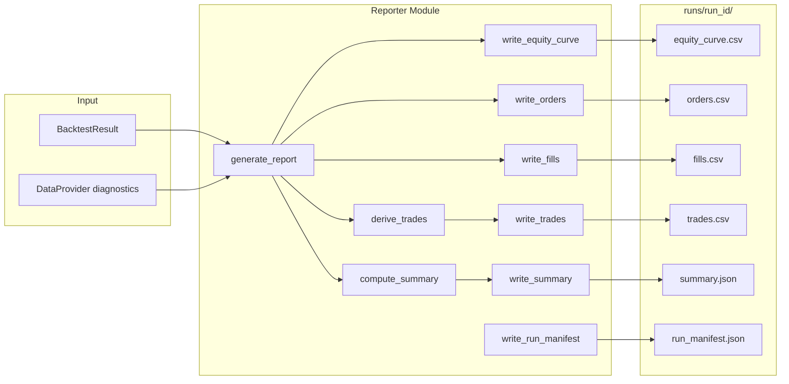

# 080: Reporter Outputs (Red-Green-Refactor)

Conforms to [001_mvp_implementation_roadmap.md](001_mvp_implementation_roadmap.md) Step 7, [000_options_backtester_mvp.md](000_options_backtester_mvp.md) M8 and §9.

---

## Objective

Produce all required run artifacts from a `BacktestResult`:

- `equity_curve.csv` — per-timestamp equity
- `orders.csv` — all orders submitted by strategy
- `fills.csv` — all fills produced by broker
- `trades.csv` — matched open/close trade ledger (derived from fills + orders)
- `summary.json` — computed metrics (return, drawdown, win rate, fees)
- `run_manifest.json` — config snapshot, seed, data range, git hash, diagnostics

All artifacts written to `runs/{run_id}/` per 000 §9.

---

## Existing Foundation

| Artifact            | Location                                                     | Usage                                                               |
| ------------------- | ------------------------------------------------------------ | ------------------------------------------------------------------- |
| `BacktestResult`    | [src/engine/result.py](../src/engine/result.py)              | config, equity_curve, orders, fills, events, final_portfolio        |
| `EquityPoint`       | [src/engine/result.py](../src/engine/result.py)              | ts, equity                                                          |
| `Order`             | [src/domain/order.py](../src/domain/order.py)                | id, ts, instrument_id, side, qty, order_type, limit_price, tif      |
| `Fill`              | [src/domain/fill.py](../src/domain/fill.py)                  | order_id, ts, fill_price, fill_qty, fees, liquidity_flag            |
| `PortfolioState`    | [src/domain/portfolio.py](../src/domain/portfolio.py)        | cash, positions, realized_pnl, unrealized_pnl, equity               |
| `BacktestConfig`    | [src/domain/config.py](../src/domain/config.py)              | symbol, start, end, timeframe_base, data_provider_config, seed, initial_cash, fee_config, fill_config |
| `Event`             | [src/domain/event.py](../src/domain/event.py)                | ts, type, payload                                                   |
| `get_run_manifest_data` | [src/loader/provider.py](../src/loader/provider.py)      | DataProvider config + diagnostics dict                               |

---

## New Concepts Introduced

### Trade (matched open/close)

A trade pairs an opening fill with its closing fill for the same instrument. FIFO matching. Enables win/loss analysis and trade-level P&L.

```python
@dataclass
class Trade:
    instrument_id: str
    side: str              # "LONG" or "SHORT" (direction of opening)
    qty: int
    entry_ts: datetime
    entry_price: float
    exit_ts: datetime
    exit_price: float
    realized_pnl: float
    fees: float
    multiplier: float
```

### SummaryMetrics

Computed from BacktestResult. All values derivable; no hidden state.

```python
@dataclass
class SummaryMetrics:
    initial_cash: float
    final_equity: float
    total_return_pct: float
    realized_pnl: float
    unrealized_pnl: float
    max_drawdown: float
    max_drawdown_pct: float
    num_trades: int
    num_winning: int
    num_losing: int
    win_rate: float
    total_fees: float
    start: str             # ISO datetime
    end: str               # ISO datetime
    num_steps: int
```

---

## Module Layout

```
src/reporter/
  __init__.py          # exports generate_report, Trade, SummaryMetrics, derive_trades, compute_summary
  trades.py            # Trade dataclass, derive_trades (FIFO matching)
  summary.py           # SummaryMetrics dataclass, compute_summary
  reporter.py          # generate_report orchestration, CSV/JSON writers
  tests/
    __init__.py
    test_trades.py     # Phase 1 tests
    test_summary.py    # Phase 2 tests
    test_reporter.py   # Phase 3, 4 tests
```

Integration tests go in `tests/integration/test_reporter.py` (Phase 5).

---

## Implementation Phases

### Phase 1: Trade Ledger Derivation

| Stage        | Tasks                                                                                                                                                                                                                                                                                                                                                           |
| ------------ | --------------------------------------------------------------------------------------------------------------------------------------------------------------------------------------------------------------------------------------------------------------------------------------------------------------------------------------------------------------- |
| **Red**      | Tests in `src/reporter/tests/test_trades.py`: (1) `Trade` dataclass holds all fields. (2) `derive_trades(fills, orders) -> list[Trade]` — single buy then sell produces 1 trade with correct entry/exit prices. (3) Multiple instruments produce separate trades. (4) No fills → empty list. (5) Open position (buy without sell) produces no trade. (6) Realized P&L computed correctly: `(exit_price - entry_price) * qty * multiplier` for long. (7) Fees summed from entry + exit fills. (8) Short trade (sell-to-open, buy-to-close) produces trade with side="SHORT" and correct P&L. |
| **Green**    | Implement `Trade` dataclass and `derive_trades` in `src/reporter/trades.py`. Walk fills in order, tracking open positions per instrument_id via order lookup (for side/instrument_id). FIFO matching: when a fill reduces/closes a position, emit a Trade. Use `order.instrument_id` and `order.side` to determine direction. Default `multiplier=100.0`.         |
| **Refactor** | Extract FIFO position tracker helper. Docstrings with reasoning.                                                                                                                                                                                                                                                                                                 |


### Phase 2: Summary Metrics

| Stage        | Tasks                                                                                                                                                                                                                                                                                                                                 |
| ------------ | ------------------------------------------------------------------------------------------------------------------------------------------------------------------------------------------------------------------------------------------------------------------------------------------------------------------------------------- |
| **Red**      | Tests in `src/reporter/tests/test_summary.py`: (1) `SummaryMetrics` dataclass holds all fields. (2) `compute_summary(result) -> SummaryMetrics` — initial_cash and final_equity from result. (3) total_return_pct = (final - initial) / initial. (4) max_drawdown computed from equity curve peak-to-trough. (5) max_drawdown_pct relative to peak. (6) num_trades, num_winning, num_losing, win_rate from trades. (7) total_fees = sum of all fill fees. (8) Empty result (no trades) produces valid metrics with zero trades and zero drawdown. (9) `to_dict()` returns JSON-serializable dict. |
| **Green**    | Implement `SummaryMetrics` and `compute_summary(result: BacktestResult) -> SummaryMetrics` in `src/reporter/summary.py`. Internally calls `derive_trades` to get trade list. Drawdown: track running peak of equity, max(peak - equity) for absolute, max((peak - equity)/peak) for pct.                                              |
| **Refactor** | Extract `_compute_max_drawdown` helper. Ensure no division by zero (initial_cash=0, no equity points). Docstrings.                                                                                                                                                                                                                   |


### Phase 3: CSV / JSON Writers

| Stage        | Tasks                                                                                                                                                                                                                                                                                                                                      |
| ------------ | ------------------------------------------------------------------------------------------------------------------------------------------------------------------------------------------------------------------------------------------------------------------------------------------------------------------------------------------ |
| **Red**      | Tests in `src/reporter/tests/test_reporter.py`: (1) `write_equity_curve(path, equity_curve)` writes CSV with columns `ts,equity`; rows match equity_curve entries. (2) `write_orders(path, orders)` writes CSV with columns `id,ts,instrument_id,side,qty,order_type,limit_price,tif`. (3) `write_fills(path, fills)` writes CSV with columns `order_id,ts,fill_price,fill_qty,fees,liquidity_flag`. (4) `write_trades(path, trades)` writes CSV with columns matching Trade fields. (5) `write_summary(path, summary)` writes JSON matching SummaryMetrics.to_dict(). (6) `write_run_manifest(path, config, provider_data)` writes JSON with config, provider diagnostics, and git_hash. All tests use `tmp_path` fixture. |
| **Green**    | Implement writer functions in `src/reporter/reporter.py`. Use `csv.DictWriter` for CSVs, `json.dump` for JSON. Datetimes formatted as ISO strings.                                                                                                                                                                                        |
| **Refactor** | Extract shared `_write_csv` helper for common pattern. Ensure consistent datetime formatting.                                                                                                                                                                                                                                               |


### Phase 4: generate_report Orchestration

| Stage        | Tasks                                                                                                                                                                                                                                                                                                                                                |
| ------------ | ---------------------------------------------------------------------------------------------------------------------------------------------------------------------------------------------------------------------------------------------------------------------------------------------------------------------------------------------------- |
| **Red**      | Tests in `src/reporter/tests/test_reporter.py`: (1) `generate_report(result, output_dir, *, provider=None)` creates `runs/{run_id}/` under output_dir. (2) All 6 files present: equity_curve.csv, orders.csv, fills.csv, trades.csv, summary.json, run_manifest.json. (3) run_id derived from config (symbol + start + timeframe or timestamp). (4) Each file is non-empty and parseable (CSV loads, JSON loads). (5) With provider=None, run_manifest omits diagnostics. (6) Returns path to run directory. |
| **Green**    | Implement `generate_report` in `src/reporter/reporter.py`. Generate run_id, create directory, call each writer. Pass `provider.get_run_manifest_data()` if provider given.                                                                                                                                                                            |
| **Refactor** | Export from `__init__.py`. Ensure run_id is filesystem-safe. Docstrings.                                                                                                                                                                                                                                                                              |


### Phase 5: Integration Tests (after initial implementation)

These tests run the full pipeline: `run_backtest` → `generate_report` → verify artifacts. Created **after** Phases 1–4 are green.

| Stage        | Tasks                                                                                 |
| ------------ | ------------------------------------------------------------------------------------- |
| **Red**      | Tests in `tests/integration/test_reporter.py` (details below).                        |
| **Green**    | All integration tests pass with the Reporter implementation from Phases 1–4.          |
| **Refactor** | Shared helpers extracted; consistent assertion style.                                  |

#### Integration Test Specifications

All tests use `@pytest.mark.integration` and the shared `provider` / `provider_config` fixtures.

| # | Test Name                                        | Purpose                                                                                                                                                        |
|---|--------------------------------------------------|----------------------------------------------------------------------------------------------------------------------------------------------------------------|
| 1 | `test_report_null_strategy_all_files`            | NullStrategy run → `generate_report`. All 6 files exist. equity_curve.csv has rows. orders.csv and fills.csv are header-only (no trades). summary.json parseable. |
| 2 | `test_report_buy_once_trades_csv`                | BuyOnceStrategy run. trades.csv is empty (position still open — no round-trip). fills.csv has 1 row. orders.csv has 1 row.                                      |
| 3 | `test_report_buy_sell_roundtrip_trade`           | BuySellStrategy run. trades.csv has 1 trade with correct entry/exit prices and realized P&L.                                                                    |
| 4 | `test_report_summary_metrics_consistent`         | Summary total_return_pct matches (final_equity - initial_cash) / initial_cash. max_drawdown >= 0. num_trades matches trades.csv row count.                      |
| 5 | `test_report_run_manifest_has_config`            | run_manifest.json contains config fields (symbol, start, end, timeframe_base, seed). Parseable and round-trips via BacktestConfig.from_dict.                    |
| 6 | `test_report_determinism`                        | Two identical runs produce identical CSV/JSON content (A5). Compare file contents byte-for-byte.                                                                |
| 7 | `test_report_with_fees`                          | FeeModelConfig applied. summary.json total_fees > 0. fills.csv fees column populated.                                                                           |

---

## Output File Specifications

### equity_curve.csv

```csv
ts,equity
2026-01-02T14:31:00+00:00,100000.0
2026-01-02T14:32:00+00:00,99850.0
...
```

### orders.csv

```csv
id,ts,instrument_id,side,qty,order_type,limit_price,tif
buy-1,2026-01-02T14:31:00+00:00,SPY|2026-01-17|C|480|100,BUY,1,market,,GTC
```

### fills.csv

```csv
order_id,ts,fill_price,fill_qty,fees,liquidity_flag
buy-1,2026-01-02T14:31:00+00:00,5.30,1,1.15,
```

### trades.csv

```csv
instrument_id,side,qty,entry_ts,entry_price,exit_ts,exit_price,realized_pnl,fees,multiplier
SPY|2026-01-17|C|480|100,LONG,1,2026-01-02T14:31:00+00:00,5.30,2026-01-02T14:32:00+00:00,5.50,20.0,2.30,100.0
```

### summary.json

```json
{
  "initial_cash": 100000.0,
  "final_equity": 100020.0,
  "total_return_pct": 0.0002,
  "realized_pnl": 20.0,
  "unrealized_pnl": 0.0,
  "max_drawdown": 150.0,
  "max_drawdown_pct": 0.0015,
  "num_trades": 1,
  "num_winning": 1,
  "num_losing": 0,
  "win_rate": 1.0,
  "total_fees": 2.30,
  "start": "2026-01-02T14:31:00+00:00",
  "end": "2026-01-02T14:35:00+00:00",
  "num_steps": 5
}
```

### run_manifest.json

```json
{
  "run_id": "SPY_1m_20260102_20260102",
  "config": { ... BacktestConfig.to_dict() ... },
  "provider_diagnostics": { ... provider.get_run_manifest_data() ... },
  "git_hash": "d3cbc0d" | null
}
```

---

## Data Flow



---

## Key Design Decisions

| Decision                                             | Rationale                                                                                                                |
| ---------------------------------------------------- | ------------------------------------------------------------------------------------------------------------------------ |
| Pure functions for all writers                       | No hidden state. Each writer takes data + path, writes file. Testable in isolation with `tmp_path`.                      |
| `derive_trades` is separate from summary             | Trade ledger is an independent artifact (trades.csv). Summary consumes trades for metrics. Decoupled for testability.    |
| FIFO matching for trades                             | Standard accounting convention. Simpler than LIFO or specific-lot. Sufficient for MVP.                                   |
| `generate_report` as orchestration function          | Single entry point for Reporter. Callers don't need to know about individual writers.                                    |
| run_id from config fields                            | Deterministic naming: `{symbol}_{timeframe}_{start_date}_{end_date}`. Filesystem-safe. Reproducible.                    |
| git_hash best-effort                                 | `subprocess.run(["git", "rev-parse", "--short", "HEAD"])` wrapped in try/except. None if not in a git repo.              |
| CSV via `csv.DictWriter`, JSON via `json.dump`       | Standard library only. No pandas dependency for output. Consistent datetime as ISO strings.                              |
| Open positions do NOT produce a Trade                | Trade requires entry + exit. Open positions are visible in final_portfolio. Keeps trades.csv clean for closed round-trips.|

---

## pyproject.toml Update

Add `src/reporter/tests` to `testpaths`:

```toml
testpaths = ["src/domain/tests", "src/loader/tests", "src/marketdata/tests", "src/clock/tests", "src/portfolio/tests", "src/broker/tests", "src/engine/tests", "src/reporter/tests", "tests/integration"]
```

---

## Acceptance Criteria

- `Trade` dataclass with FIFO matching via `derive_trades(fills, orders)`
- `SummaryMetrics` with return, drawdown, win rate, fees via `compute_summary(result)`
- CSV writers for equity_curve, orders, fills, trades; JSON writers for summary, run_manifest
- `generate_report(result, output_dir)` creates `runs/{run_id}/` with all 6 files
- run_manifest includes config snapshot, provider diagnostics (when available), git hash (best-effort)
- Deterministic: same BacktestResult → identical files (A5)
- All phases follow Red → Green → Refactor
- Unit tests in `src/reporter/tests/`; integration tests in `tests/integration/test_reporter.py`
- Functions under 40 lines; line length under 120; reasoning docstrings
