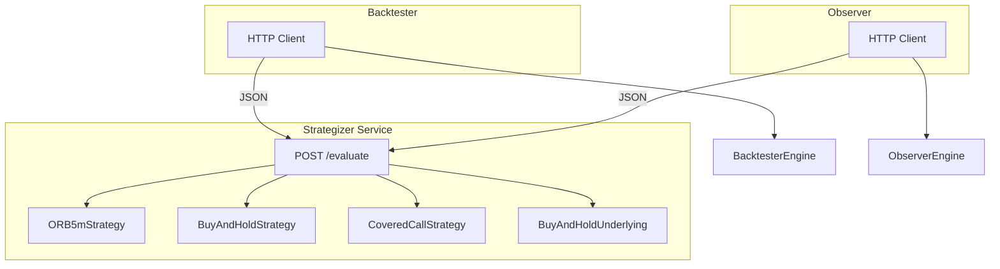

# 140: Strategizer as a Service

## Prerequisite

Before starting Plan 140: **current backtester and observer must run successfully with the in-process strategizer**. Verify with `make backend` + `make frontend` (observer) and `python -m src.runner configs/covered_call_example.yaml` (backtester). All four strategies (orb_5m, buy_and_hold, covered_call, buy_and_hold_underlying) must pass golden and integration tests.

---

## Design Decisions

| Decision | Choice | Rationale |
|----------|--------|-----------|
| **Architecture** | Strategizer as standalone REST service | Clean boundaries, no build deps, agent-ready |
| **API style** | REST, JSON | Simple, debuggable, language-agnostic |
| **Strategy state** | Stateless (step_index in each request) | No server-side sessions; simpler scaling |
| **Portfolio** | Not in scope; future plan | Strategies use entry-only or broker-managed exits |
| **Latency** | Accept slower backtesting | Trading cadence max 1/min; negligible for live |
| **Operational burden** | Accepted | Three services to run |
| **Trailing stops** | Deferred to Plan 150 | Backtester fill/position logic; trend strategy |

---

## Strategy List (No Portfolio Required)

| Strategy | Type | Exit | Notes |
|----------|------|------|-------|
| **orb_5m** | Entry only | Stop placed at entry | Futures; breakout + stop loss |
| **buy_and_hold** | Entry only | Option expiry | Options; buy on step 1 |
| **buy_and_hold_underlying** | Entry only | Hold to end | Equity; buy on step 1 |
| **covered_call** | Time-based | step_index == exit_step | Buy step 1, sell step N |

---

## Architecture



---

## Operational Config

| Setting | Location | Default | Notes |
|---------|----------|---------|------|
| STRATEGIZER_URL | .env (backtester, observer) | http://localhost:8001 | Service base URL |
| STRATEGIZER_PORT | .env (strategizer) | 8001 | Avoid conflict with observer backend (8000) |

**Error handling**: If strategizer returns 5xx or is unreachable, fail fast (raise). No retries for MVP. Log error with URL.

---

## Types and Standards Document

Create `.cursor/plans/types_and_standards.md`:

- **Time**: All internal data, API payloads, serialization use **UTC** (ISO 8601: `2026-01-02T14:35:00Z`). UI converts to **Central (America/Chicago)** for display only. Example: bar at `14:35Z` displays as `9:35 AM CT`.
- **Prices**: float; decimals as needed per instrument
- **Quantities**: int
- **IDs**: stable strings (UUID for orders/candidates)
- **JSON schemas**: Include EvaluateContext, Signal, and SpecView request/response schemas to prevent client/server drift
- **SpecView**: `{ "tick_size": float, "point_value": float, "session": { "timezone": str, "start_time": "HH:MM:SS", "end_time": "HH:MM:SS" } }`
- **API contract**: Allowed values — `direction`: "LONG" | "SHORT"; `entry_type`: "MARKET" | "LIMIT" | "STOP"
- **Bar payload**: For step-only strategies (buy_and_hold, covered_call), client may send minimal or empty bars; strategy uses `step_index` only

---

## Interface Definitions

### EvaluateContext (request body)

```json
{
  "ts": "2026-01-02T14:35:00Z",
  "step_index": 1,
  "strategy_name": "orb_5m",
  "strategy_params": { "min_range_ticks": 4, "max_range_ticks": 40, "qty": 1 },
  "bars_by_symbol": { "ESH26": { "5m": [{"ts": "...", "open": 5400, ...}] } },
  "specs": { "ESH26": { "tick_size": 0.25, "point_value": 50, "session": { "timezone": "America/Chicago", "start_time": "09:30:00", "end_time": "16:00:00" } } },
  "portfolio": {}
}
```

- `step_index`: 1-based; required for stateless strategies. **Backtester**: engine loop step (`enumerate(iter_times(...), start=1)`). **Observer**: `len(ctx.bars[symbol][eval_timeframe])` where symbol = strategy's primary symbol (requirements.symbols[0]), eval_timeframe from engine config; bars in current session.
- `strategy_params`: strategy-specific config; client passes from run config
- `portfolio`: empty object for now; future: positions, cash, equity

### Signal (response item)

```json
{
  "symbol": "ESH26",
  "instrument_id": null,
  "direction": "LONG",
  "entry_type": "STOP",
  "entry_price": 5410.25,
  "stop_price": 5404.75,
  "targets": [5415.75, 5421.25],
  "qty": 1
}
```

- `qty`: int; strategies populate from `strategy_params` (add to Signal type)
- `instrument_id`: for options = contract_id from params; for futures/equity = null (use symbol)

---

## Implementation Phases

### Phase 0: Types and Standards

1. Create `.cursor/plans/types_and_standards.md` with UTC/Central rule, type conventions, SpecView JSON schema (session times as "HH:MM:SS"), and JSON schemas for EvaluateContext and Signal (incl. qty, instrument_id; direction/entry_type allowed values)

### Phase 1: Strategizer Service

1. Restructure strategizer as a service project (FastAPI, uvicorn)
2. Add `POST /evaluate` — accepts JSON EvaluateContext (incl. `strategy_params`), returns JSON list of Signals
3. Add `GET /health` — returns `{ "status": "ok", "strategies": ["orb_5m", "buy_and_hold", ...] }` for liveness
4. Strategy routing: map `strategy_name` to implementation via registry; pass `strategy_params` into strategy logic per request
5. Add `qty` and `instrument_id` to Signal type (strategizer types.py and API schema)
6. Refactor **ORB5mStrategy to be fully stateless**: derive opening range and fired state from bars on each request (no instance state between calls)
7. Implement stateless strategies with `step_index`:
   - ORB 5m (refactored per above)
   - BuyAndHold (option): `step_index == 1` → buy; `strategy_params`: `{ contract_id, qty }`; emit `instrument_id: contract_id`
   - BuyAndHoldUnderlying: `step_index == 1` → buy; `instrument_id: null`
   - CoveredCall: `step_index == 1` → buy; `step_index == exit_step` → sell; `strategy_params`: `{ contract_id, exit_step, qty }`; emit `instrument_id: contract_id`
8. Serialize/deserialize EvaluateContext and Signal (UTC datetimes per types doc; specs.session times as "HH:MM:SS" strings)

### Phase 2: Backtester HTTP Client

1. Add **HttpStrategizerStrategy** (`strategy_name`, `strategy_params`, `strategizer_url`) — implements `on_step(snapshot, portfolio) → list[Order]`; builds EvaluateContext, POSTs, maps Signals to Orders
2. Engine loop: add `step_index` via `enumerate(iter_times(...), start=1)`; pass to HTTP client when building EvaluateContext
3. Remove strategizer from backtester's pip dependencies
4. Replace all four strategy paths with HttpStrategizerStrategy; config `strategy.params` → `EvaluateContext.strategy_params`
5. Config: `STRATEGIZER_URL` in .env; fail fast if unreachable or 5xx

### Phase 3: Observer HTTP Client

1. Remove strategizer from observer's pip dependencies
2. Replace StrategizerStrategyAdapter's in-process call with HTTP POST; registry instantiates HTTP-backed strategy when `source: strategizer` (no local strategizer package import)
3. Add HTTP client that implements `BaseStrategy.evaluate(ctx)`; builds EvaluateContext from Context, POSTs, converts response to TradeCandidates
4. Config `strategy.params` → `EvaluateContext.strategy_params`
5. `step_index`: `len(ctx.bars[symbol][eval_timeframe])` — symbol from strategy requirements, eval_timeframe from engine config

### Phase 4: Remove Backtester-Native Strategies

1. Delete `buy_and_hold.py`, `covered_call.py`, `buy_and_hold_underlying.py`, `orb_futures.py` from backtester
2. Runner: all strategies via HTTP; config strategy name → strategy_name in request

### Phase 5: Testing

1. **Unit tests**: Mock Strategizer HTTP (responses fixture); no service required
2. **Integration tests**: Require running Strategizer; skip if unreachable
3. Golden tests: use mock; deterministic fixtures

### Phase 6: Documentation and Startup

1. Root README: startup order (strategizer on 8001 → backend → frontend for observer; strategizer → backtester for runs)
2. Strategizer README: how to run, port, API contract, strategy list

---

## EvaluateContext Schema

```python
# Request
{
  "ts": str,                    # ISO 8601 UTC
  "step_index": int,            # 1-based
  "strategy_name": str,
  "strategy_params": dict,
  "bars_by_symbol": { str: { str: list[BarInput] } },
  "specs": { str: SpecView },   # tick_size, point_value, session {timezone, start_time "HH:MM:SS", end_time "HH:MM:SS"}
  "portfolio": {}
}
```

---

## Risks (Acknowledged)

| Risk | Status |
|------|--------|
| Slower backtesting | Accepted |
| Serialization / type drift | Mitigated by types_and_standards.md |
| Operational burden (3 services) | Accepted |
| Stateless design | Implemented via step_index |

---

## Verification Checklist (Pre-Implementation)

- [ ] ORB stateless refactor in Phase 1
- [ ] step_index: backtester `enumerate` + observer bar-count formula
- [ ] Signal: qty + instrument_id in types.py and API schema
- [ ] Options: contract_id in strategy_params, instrument_id in Signal
- [ ] SpecView JSON schema in types doc
- [ ] HttpStrategizerStrategy in Phase 2
- [ ] Observer registry HTTP-backed strategies in Phase 3

---

## Agent Readiness

- Strategizer service is the contract; agent can call same API
- No consumer types in strategizer; pure JSON in/out
- Future: Portfolio service; EvaluateContext.portfolio populated by client from Portfolio API
- Future: Plan 150 adds trailing stops and trend_entry_trailing_stop
