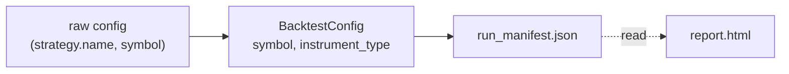

# 141: Backtest Report Metadata and Title

## Part 1: Add Strategy, Symbol, and Asset Type to Report

### Current state
- Report title: static "Backtest Report" ([visualize.py](backtester/src/reporter/visualize.py) lines 136, 154)
- `generate_html_report` reads: `summary.json`, `equity_curve.csv`, `trades.csv`, `fills.csv` — no strategy metadata
- `BacktestConfig` has `symbol` and `instrument_type` but no `strategy_name`
- `run_manifest.json` stores `config.to_dict()` (includes symbol, instrument_type)

### Data flow

### Implementation

1. **Add `strategy_name` to BacktestConfig**
   - `config.py`: Add `strategy_name: str = ""` to dataclass; include in `to_dict()` / `from_dict()`.
   - `runner.py`: In `_build_backtest_config`, set `strategy_name=raw.get("strategy", {}).get("name", "")`.

2. **Pass metadata into HTML report**
   - Extend `generate_html_report` to read `run_manifest.json` (already written to run_dir) and extract `config.strategy_name`, `config.symbol`, `config.instrument_type`.

3. **Update visualize.py**
   - Add `_read_run_manifest(run_dir) -> dict` to load `run_manifest.json`.
   - Extract `strategy_name`, `symbol`, `instrument_type` from `manifest["config"]`.
   - Update `_render_html` to accept these and render:
     - Page title: `{strategy_name} — {symbol} ({instrument_type})` (or "Backtest Report" if strategy_name empty)
     - H1: same as title
     - Add summary rows: Strategy, Symbol, Asset Type

4. **Display format**
   - Title: `Buy and Hold Underlying — SPY (equity)` or `ORB 5m — ESH26 (future)`
   - Summary table: Human labels for asset type (equity → Equity, option → Option, future → Future)

### Files to change
- `backtester/src/domain/config.py` — add strategy_name
- `backtester/src/runner.py` — set strategy_name from raw config
- `backtester/src/reporter/visualize.py` — read run_manifest, render title and metadata rows

---

## Part 2: Buy-and-Hold Underlying — Held Asset Value

### User concern
"buy and hold underlying example never includes the value of held assets at the end of the strategy, so will always be a loss"

### Investigation results

**Equity does include held assets.** The flow:
1. `extract_marks`: underlying gets bar close as mark
2. `mark_to_market`: positions valued at mark
3. Engine records `portfolio.equity` in equity curve

Integration test `test_underlying_equity_curve_tracks_price` confirms equity varies as SPY price moves.

**Why Trade P&L shows a "loss"**
- Open positions are emitted as trades via `open_marks`: remaining lots are "closed" at final mark for reporting
- If last bar close is below fill price, pseudo-trade shows negative P&L
- Win/Loss count treats that open position as a "losing" trade

**Conclusion:** System correctly includes held asset value. No bug fix needed. Optionally label open positions in Trade P&L (e.g. "(Open)") for clarity.

---

## Verification
- Run `buy_and_hold_underlying_example.yaml`, `orb_5m_example.yaml`, `buy_and_hold_example.yaml` — confirm title and metadata
- Check golden test and `test_reporter` for any required updates
