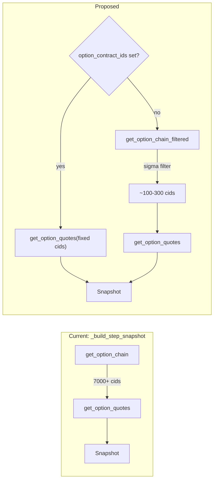

# Speed Covered Call Backtest

## Problem

The covered call config runs ~1,250 daily steps (2021-01-04 to 2025-12-12). Each step calls `get_option_chain` (7,000+ SPY contracts) then `get_option_quotes` for all of them. The covered_call strategy only uses a single fixed `contract_id`. Plan 251 added batch quote loading and metadata indexing, but the per-step chain+quotes cost still dominates.



---

## Solution 1: Contract-scoped snapshot (highest impact)

When a strategy declares a fixed `contract_id`, skip `get_option_chain` entirely and only fetch quotes for those contracts.

**Config field:** `option_contract_ids: list[str] | None = None` on `BacktestConfig`.

**Resolution order** (runner):
1. Explicit `option_contract_ids` in YAML config (user override)
2. Inferred from `strategy.contract_id` param (automatic for covered_call, buy_and_hold)
3. `None` = full chain (default)

**Constraint:** `option_contract_ids` must be a superset of all contracts the strategy will hold. `extract_marks` only produces marks for contracts in the snapshot; a held contract missing from the snapshot would have a stale/missing mark. The runner enforces this by construction (it sets the list from the strategy's own `contract_id`).

**Files:**
- [backtester/src/domain/config.py](backtester/src/domain/config.py) -- add field + `to_dict`/`from_dict`
- [backtester/src/runner.py](backtester/src/runner.py) -- parse from config YAML; infer from `strategy.contract_id`
- [backtester/src/engine/engine.py](backtester/src/engine/engine.py) -- in `_build_step_snapshot`:

```python
if _needs_options(config):
    if config.option_contract_ids:
        contract_ids = config.option_contract_ids
    else:
        contract_ids = provider.get_option_chain(symbol, ts)
    quotes = provider.get_option_quotes(contract_ids, ts) if contract_ids else None
```

---

## Solution 1b: Chain filter -- +/-2 sigma around ATM

When using the full chain (no `option_contract_ids`), filter to contracts whose strike falls within +/-N standard deviations of the current underlying price.

**Formula:** `sigma_price = S * vol * sqrt(T / 365)`. Keep contract if `|strike - S| <= sigma_limit * sigma_price`. T = days to expiry per contract.

**Vol source (initial scope):** Config default only -- `option_chain_vol_default: 0.20` (20% annual). Realized vol from bar history deferred to a follow-up (avoids fetching a lookback window on every step just for the filter).

**Config fields:**
- `option_chain_sigma_limit: float | None = 2.0` (None = no filter)
- `option_chain_vol_default: float = 0.20`

**Implementation -- filter inside the provider**, not the engine. `get_option_chain` already has metadata rows (expiry, strike) from `_metadata_by_underlying`. Adding a filtered variant avoids round-tripping through contract ID strings and re-fetching metadata:

- [backtester/src/loader/provider.py](backtester/src/loader/provider.py) -- new method `get_option_chain_filtered(symbol, ts, underlying_price, sigma_limit, vol)` that filters metadata rows inline.
- [backtester/src/engine/engine.py](backtester/src/engine/engine.py) -- call `get_option_chain_filtered` when `config.option_chain_sigma_limit` is not None and `bar` is available; fall back to unfiltered `get_option_chain` otherwise.

**Effect:** 7,000 contracts -> ~100-300 per step. Scales with DTE (near-expiry = narrower band).

---

## Solution 2: Quick config

Add `configs/covered_call_example_quick.yaml` with a 1-3 month window (e.g. 2021-01-04 to 2021-03-31, ~60 steps) for fast iteration. No code changes.

---

## Solution 3: Early skip when no option positions

In the engine loop, skip options fetch when the portfolio holds no option positions. Check: `all(pid == config.symbol or pid in (config.symbols or []) for pid in portfolio.positions)`. When true, the portfolio has only equity/future positions; no option marks or chain needed.

**Guard:** Only apply when `option_contract_ids` is set (the strategy declared its universe is fixed). Without `option_contract_ids`, the strategy could issue a new option order on any step, so we cannot skip.

**Files:** [backtester/src/engine/engine.py](backtester/src/engine/engine.py) -- add `skip_options` flag before calling `_build_step_snapshot`, pass it through.

---

## Priority and flow

| Priority | Solution                  | Effort  | Impact                           |
| -------- | ------------------------- | ------- | -------------------------------- |
| 1        | Contract-scoped snapshot  | Low     | High (fixed-contract strategies) |
| 1b       | +/-2 sigma chain filter   | Medium  | High (chain-scanning strategies) |
| 2        | Quick config              | Trivial | Medium (fewer steps for dev)     |
| 3        | Early skip (no positions) | Low     | Medium (covered_call steps 6..N) |

**Decision flow per step:**
1. `option_contract_ids` set AND no option positions in portfolio -> skip options entirely
2. `option_contract_ids` set -> use those contract IDs directly
3. `option_chain_sigma_limit` set and bar available -> `get_option_chain_filtered`
4. Otherwise -> `get_option_chain` (full, unfiltered)

---

## Tests

- **Unit: sigma filter** -- synthetic metadata rows, verify filter keeps/rejects correct strikes at various DTE and vol levels.
- **Unit: contract-scoped path** -- `_build_step_snapshot` with `option_contract_ids=[cid]` skips `get_option_chain`.
- **Unit: config round-trip** -- `to_dict` / `from_dict` for the three new fields.
- **Regression** -- full `pytest tests/ -v` to confirm no breakage.

---

## Verification

```bash
cd backtester && python -m src.runner configs/covered_call_example_quick.yaml   # quick: < 5s
cd backtester && python -m src.runner configs/covered_call_example.yaml          # full 5yr: < 30s
pytest tests/ -v
```
